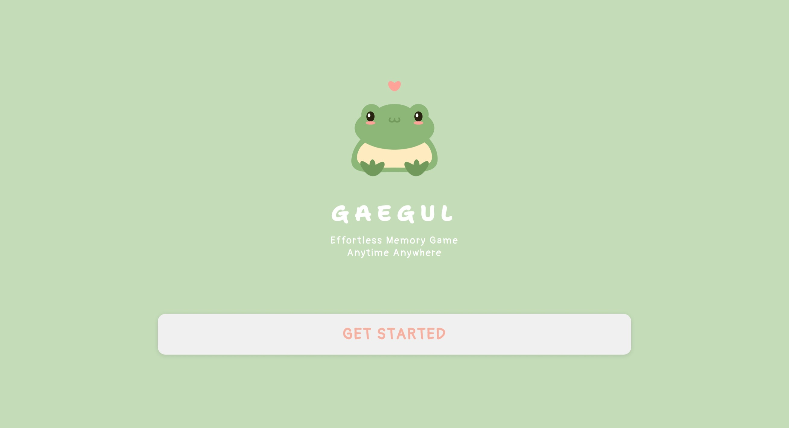
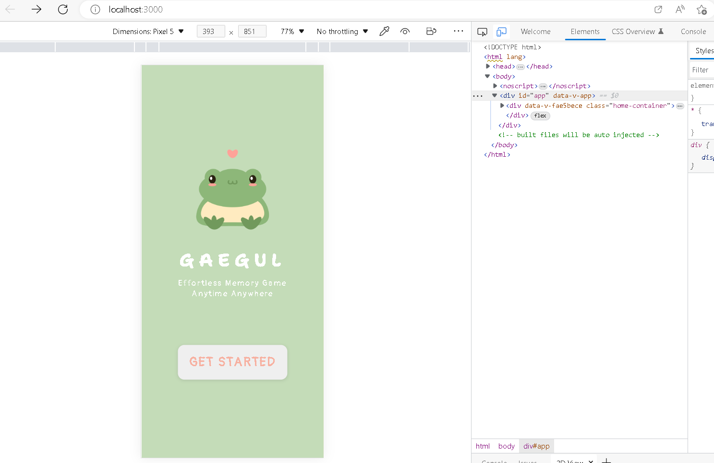
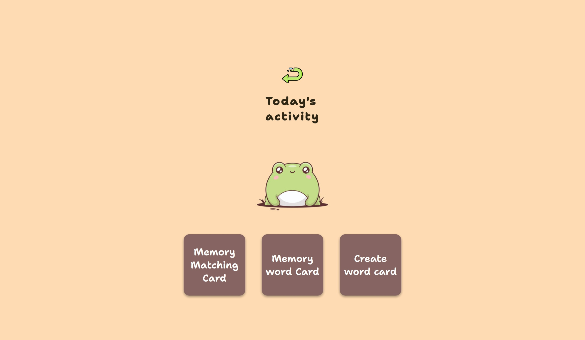
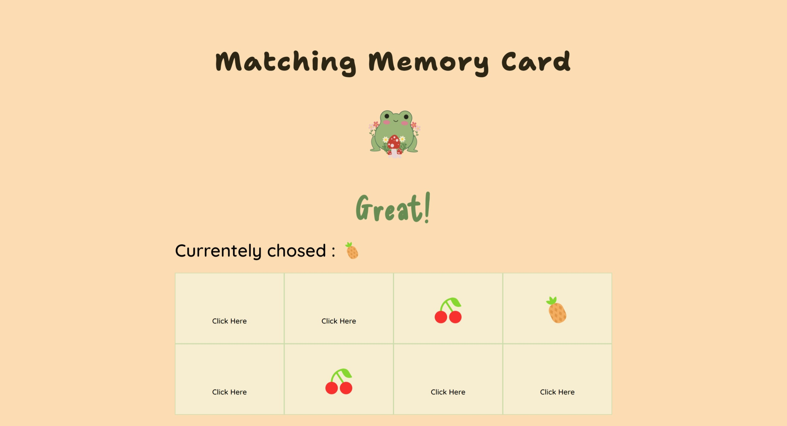
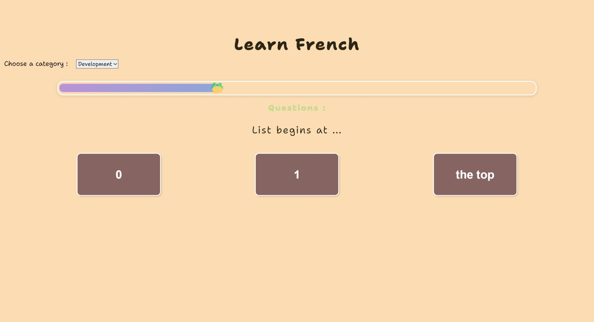
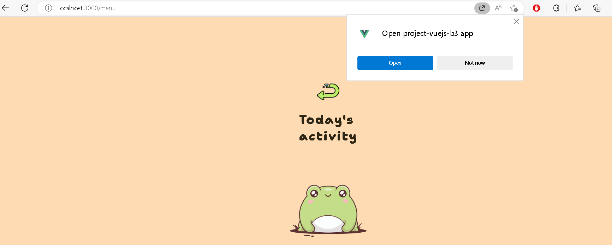
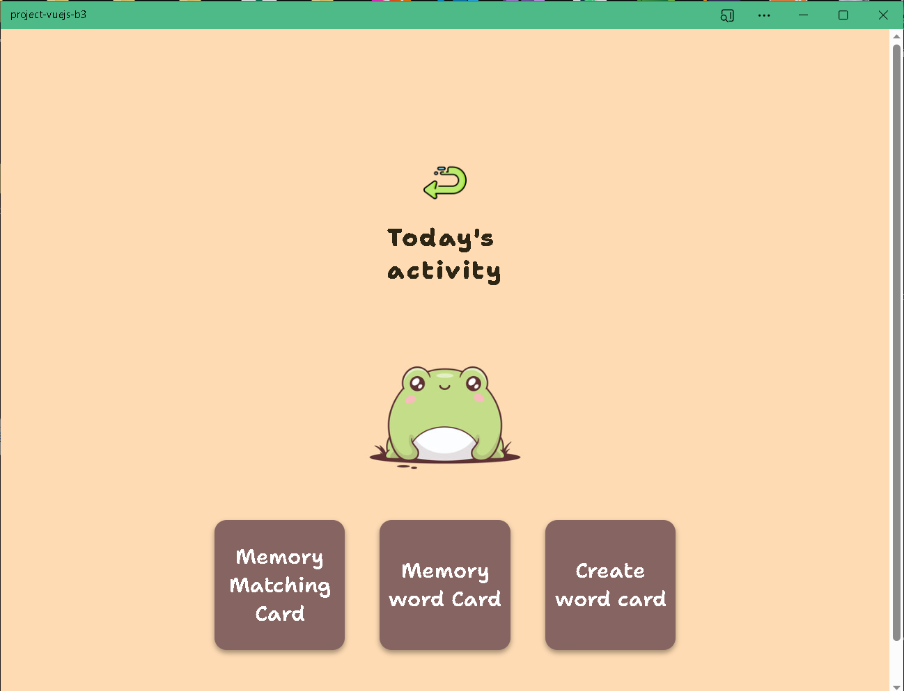
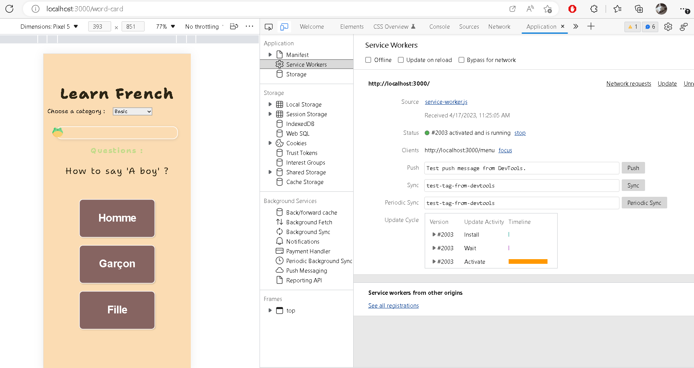
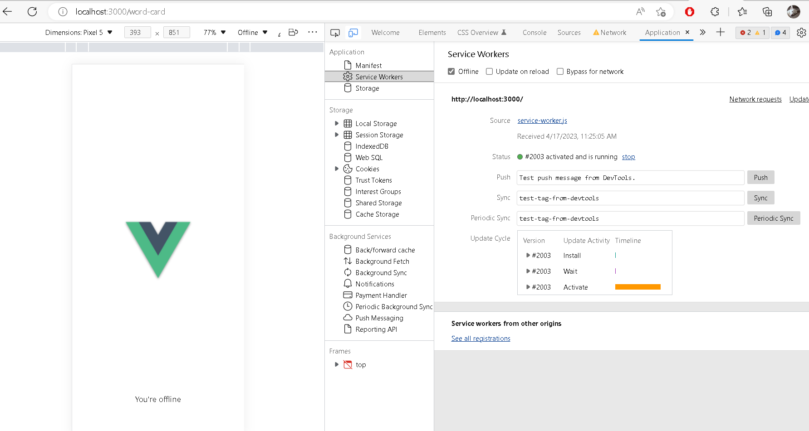

# Ynov-web-front-avancé-projet

## Déploiement du projet :

### Versions

    Node : v18.13.0

### Créer le projet

    npm init vue@latest
    cd web-front-project
    npm install
    npm run serve

## Fonctionnalités :

L'application permet à l'utilisateur d'apprendre l'anglais avec des questions portant sur différents thèmes.
Il a également la possibilité d'en créer d'autres ou d'en rajouter aux catégories existantes.

L'application peut fonctionner hors-ligne et être installer sur la machine de l'utilisateur.
Il s'agit d'une Single Page Application, donc il n'y a pas de rechargement entre chaque pages.

Le router Vue ainsi que le store Pinia ont été utilisés afin de faciliter la mise en oeuvre de l'application.

## Organisation du code / composants :

Chaque page se trouve dans le dossier views, assez peu de composants ont été utilisés au final, tout est stocké dans les views.
Les questions se situaient d'abord dans la view dédiée aux cartes, mais ont ensuite été déplacés dans le LocalStorage en passant par le store afin de garder les questions aux travers des différentes vues, notamment pour la partie création de cartes.

L'utilisation de composants auraient sans doute pu alléger le code, mais l'envergure du projet n'a pas forcément nécessité qu'on les implémentes.

## Présentation des pages :

### Accueil :

La page d'accueil propose une brève description du site, ainsi qu'un bouton pour accéder au menu des jeux.
Le reste du site s'inspirera du même design.

aussi application est resposible.

### Menu :

Le menu nous propose 3 options, le jeu de mémoire, le jeu d'apprentissage et la création de carte.

### Jeu de mémoire :

Le jeu de mémoire propose 8 cartes qui dévoilent chacune un fruit, et le but est de réussir à retourner toutes les cartes sans se tromper.
On voit les cartes retournés ainsi que la carte actuellement sélectionné.

### Jeu d'apprentissage :

Le jeu d'apprentissage nous permet de choisir une catégorie de questions, puis de répondre à chacune d'entre elle avec un choix de 3 réponses possibles.
Une barre de progression nous indique à quel pourcentage du nombre de questions nous avons répondus. 
Il est possible de changer de catégories de questions à n'importe quel moment, ce qui réinitialisera la barre de progression. 
Un score s'affiche également à la fin des questions.

### (A MODIFIER) Editeur de cartes :

### PWA :

l'application peut être indépendante en tant que logiciel de PWA. dans l'URL il y a une petite icône pour télécharger facilement cette application

ici comme vous pouvez le voir l'application est indépendante en tant que logiciel

### Service Worker :

Dans le service worker, ça marche bien aussi si cette application est hors ligne on peut voir avec une image hors ligne, ça marque bien son statut

## Lien du Github :

https://github.com/injin0301/vuejs
